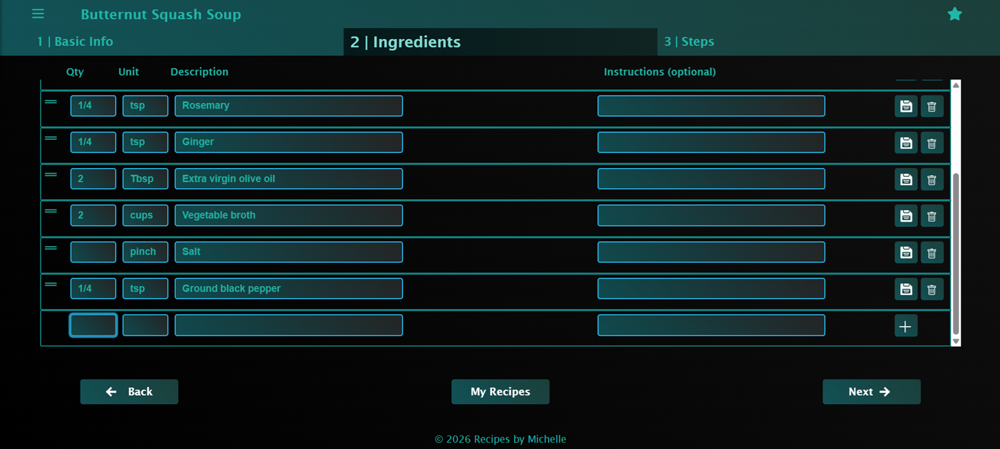
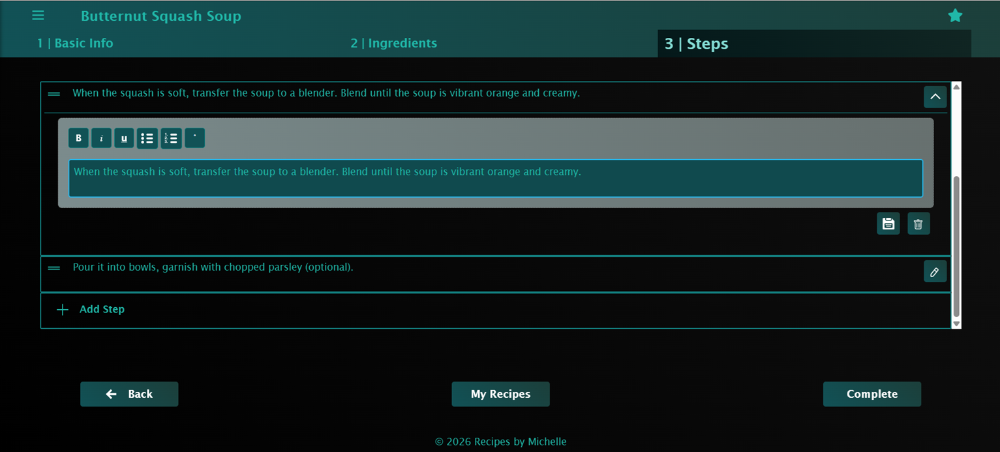
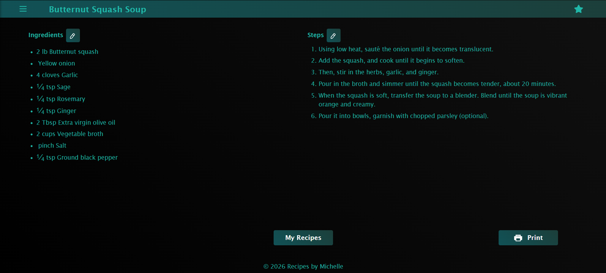
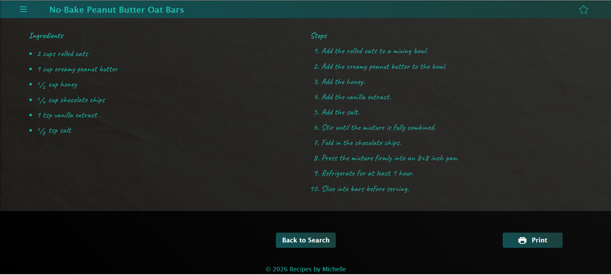
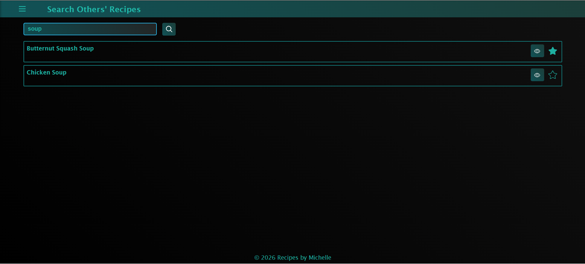
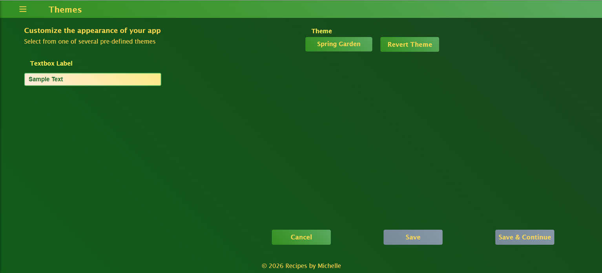

# Project Description

This project is the second‑generation version of my original .NET Razor Pages recipe app. The first version (source available at https://github.com/michelle52323/recipesbymichelle_razor) proved the concept, but this release is a full SPA rebuild using React + RESTful APIs for a faster, smoother, more modern experience. All core features were carried forward, and many were redesigned or expanded for better usability, consistency, and long‑term maintainability.

## Live URL

https://www.recipesbymichelle.app/

## Tech Stack

**Front-end**
- React.js
- TypeScript
- Bootstrap

**Back-end**
- .NET 8 Web API
- C#
- Entity Framework Core
- SQL Server

## Deployment ##

- Front-end: Azure Static Web Apps
- Back-end: Azure Web App Service
- Database: Self‑hosted VPS

## Features ##
- Add and edit recipes including ingredients and steps
- View recipes on your phone while cooking
- Search other's recipes
- Favorites list
- Support for Imperial (U.S.) and Metric units
- Theme selector with seven predefined themes, allowing users to customize the appearance of the app
- Print friendly recipe pages

## New Features ##
- Recipe font choice — Choose between a clean sans‑serif style or a handwritten aesthetic (Google Caveat) for a more personal, cookbook‑like feel.
- Ingredient auto‑correction — Quantities and units auto‑correct on blur based on the selected measurement system, reducing errors and improving consistency.
- Enhanced steps editor — Supports basic formatting (bold, italic, underline) for clearer, more readable cooking instructions.

## Screenshots ##

- 
*Edit recipe ingredients with a clean, structured interface designed for fast, error‑free entry.*

- 
*Add and organize step‑by‑step instructions using a distraction‑free editing layout.*

- 
*View recipes in a clear, mobile‑friendly layout optimized for cooking.*

- 
*Recipes can be displayed in either a clean sans‑serif style or a handwritten aesthetic, giving users a more personal, cookbook-like feel.*

- 
*Search recipes by keyword and browse results with a simple, responsive grid.*

- 
*Seven predefined themes allow users to personalize the appearance of the app.*